# Waypoint – Sorsogon Tourism App

**Waypoint** is a cross-platform mobile application built with React Native (Expo) and Firebase. It serves as a digital passport for discovering, exploring, and curating tourist destinations across the province of Sorsogon.

---

## 1. Problem Statement & Target Users

**Problem Statement:**
Discovering and planning travel itineraries in Sorsogon currently requires navigating highly fragmented information scattered across outdated travel blogs, unverified social media pages, and multiple browser tabs. Waypoint solves this by providing a unified, curated, and highly interactive digital platform that centralizes Sorsogon's tourism data.

**Target Users:**
* **Local and Foreign Tourists:** Individuals looking for a reliable guide to explore attractions and hidden gems.
* **Itinerary Planners:** Travelers who need to securely save and curate a list of specific destinations for upcoming trips.
* **Sorsogon Residents:** Locals wanting to discover new leisure spots and heritage sites within their home province.

---

## 2. Midterm vs. Final Feature List

### Midterm MVP Features
* **Public Browsing (Guest Mode):** Users can browse the Home screen, category lists, and read destination details without logging in.
* **Authentication Flow:** Firebase Email/Password login, registration, and logout.
* **Firestore CRUD:** Ability for authenticated users to Create, Read, and Delete "Favorites" tied to their specific account.
* **UX/UI Standards:** Implemented loading skeletons, empty states for new accounts, form validation on auth screens, and robust error handling.

### Final Upgrade Features
* **Device Integration (Maps):** Integrated mapping for destinations directly within the Explore and Details screens to guide users.
* **Advanced Real-Time Queries:** Dynamic category filtering (e.g., "Beach", "Heritage") using active Firestore indexing and queries.
* **Micro-Interactions & Hardware Acceleration:** Custom native-driver animations (like the bouncing favorite heart) for a premium feel.
* **Instant State Management:** Profile updates (Name/Avatar) reflect instantly across the application interface without requiring a reload.

---

## 3. Architecture Overview

* **Framework:** React Native managed by Expo.
* **Navigation:** Expo Router (File-based navigation scheme using the `app/` directory).
* **State Management:** React Hooks (`useState`, `useEffect`) alongside React Context for global user authentication state.
* **Folder Structure:** * `/app`: Contains Expo Router navigation layouts and tab definitions.
    * `/screens`: Houses the core UI logic (Home, Details, Profile, Explore).
    * `/components`: Reusable UI elements (Destination Cards, Buttons, Inputs).
    * `/services`: Contains `firebaseConfig.js` and all external database logic.
    * `/assets`: Local fonts, icons, and static placeholder images.

---

## 4. Firestore Database Architecture (NoSQL Model)

* **`users` Collection:** Stores profile data (`uid`, `displayName`, `avatarUrl`, `createdAt`). Managed securely via Firebase Auth UID.
* **`destinations` Collection:** The master, read-only list of tourist spots containing `title`, `municipality`, `category`, `description`, `imageUrl`, and `coordinates`.
* **`favorites` Collection:** A top-level collection tracking saved spots. Contains `userId`, `destinationId`, and `savedAt`.
* **`comments` Collection:** Community feedback containing `destinationId`, `userId`, `text`, and `createdAt`.

---

## 5. Security & Privacy

### Firebase Configuration Approach
No secret keys are exposed in this repository. All environment variables (API keys, project IDs) are stored locally in a `.gitignore` restricted `.env` file during development. For final EAS production builds, keys are securely injected via the build environment.

### Firestore Security Rules Summary
Strict Security Rules are enforced at the database level:
* **Destinations:** `allow read: if true;` (Publicly accessible). `allow write: if false;` (Admin only).
* **Favorites & Profile Data:** `allow read, write: if request.auth != null && request.auth.uid == resource.data.userId;` (Users can only access and modify their own documents).

### Privacy Statement
**Data Collected:** Waypoint collects basic user information (email, display name, optional avatar) and tracking of user-favorited destinations. 
**Purpose:** This data is used strictly to provide personalized itineraries and seamless account recovery. 
**Protection:** Data is encrypted and secured by Google Firebase Authentication. Waypoint does not sell, share, or distribute user data to third parties.

---

## 6. App Interface & Screenshots

*(Note to Professor: See the `/assets/images/screenshots` folder in the repository for full-resolution images)*

1.  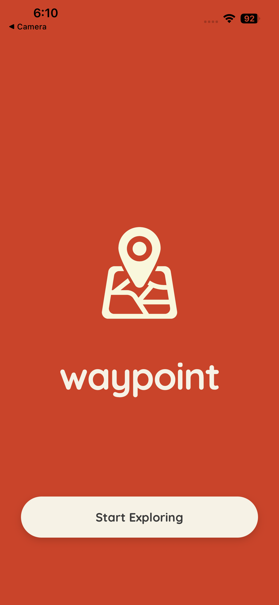 - *Onboarding / Splash Screen*
2.  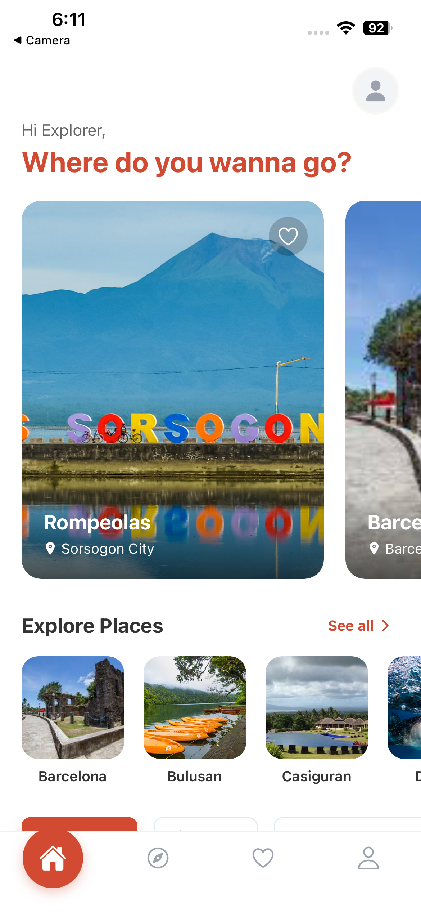 - *Dynamic Home Screen with personalized greeting*
3.  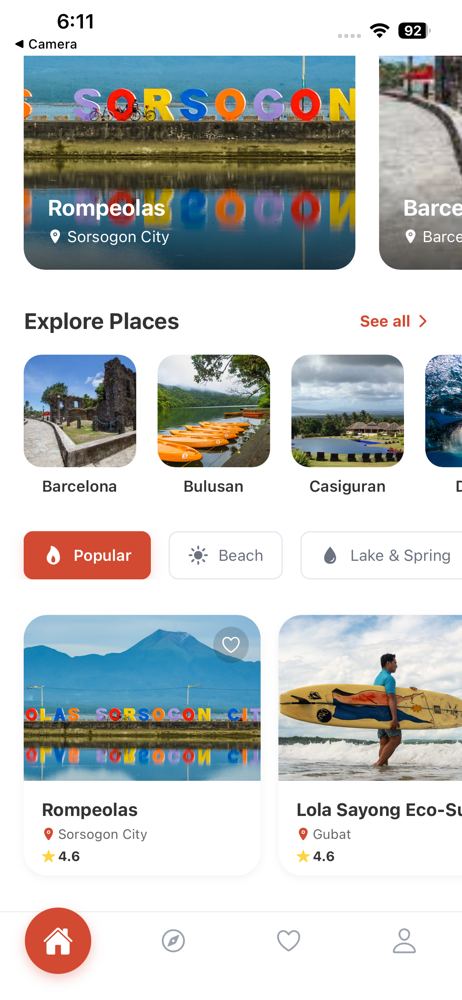 - *Active category filtering and live data carousel*
4.  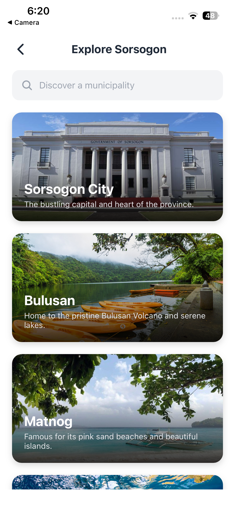 - *Complete directory of Sorsogon's municipalities*
5.  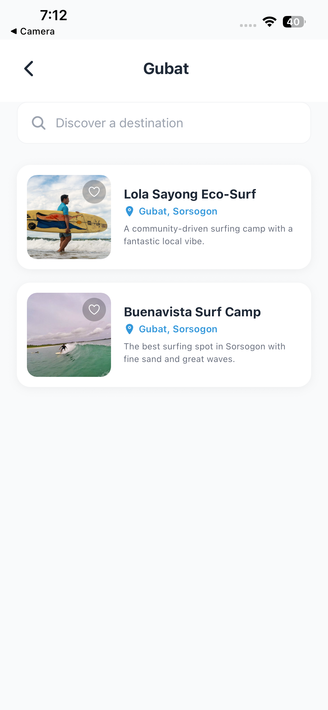 - *Filtered view of destinations within a specific municipality*
6.  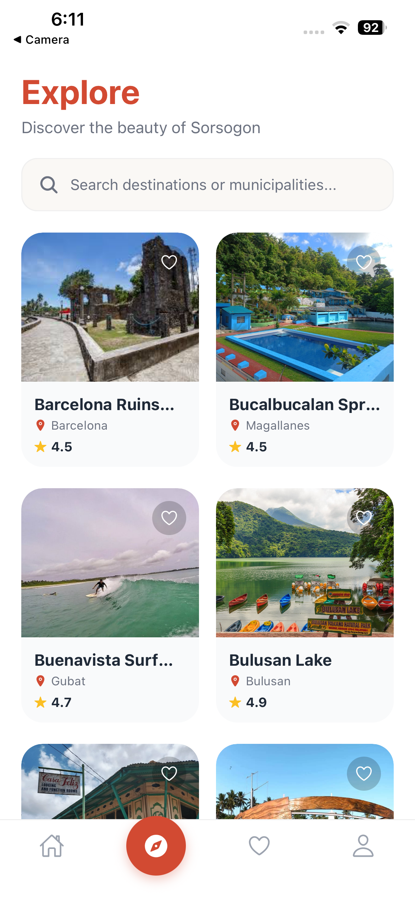 - *Explore tab for broad discovery and search*
7.  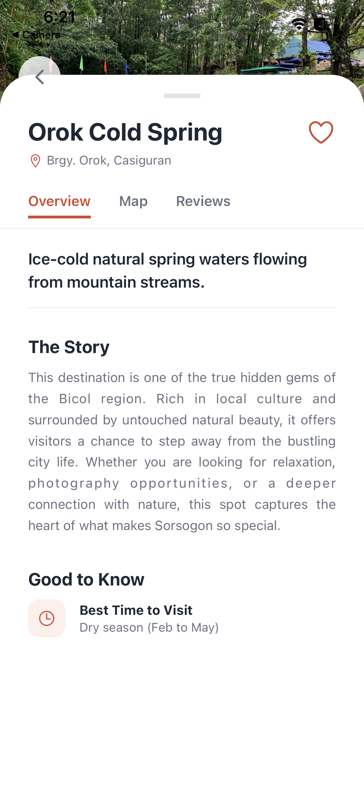 - *In-depth destination overview and high-res imagery*
8.  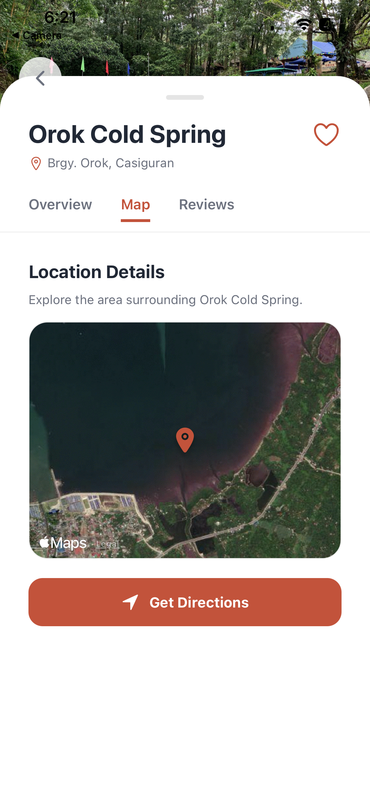 - *Integrated map view for location tracking*
9.  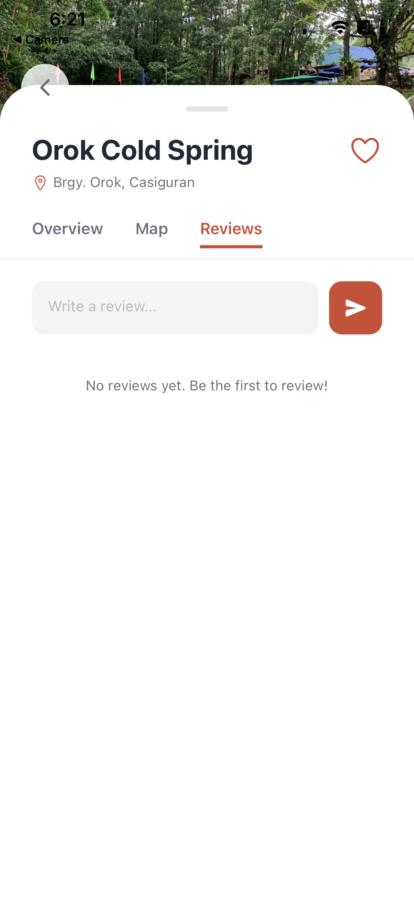 - *User feedback and community comments section*
10. 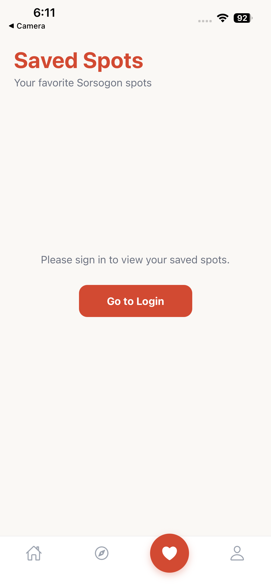 - *Authenticated user's saved favorites list*
11. 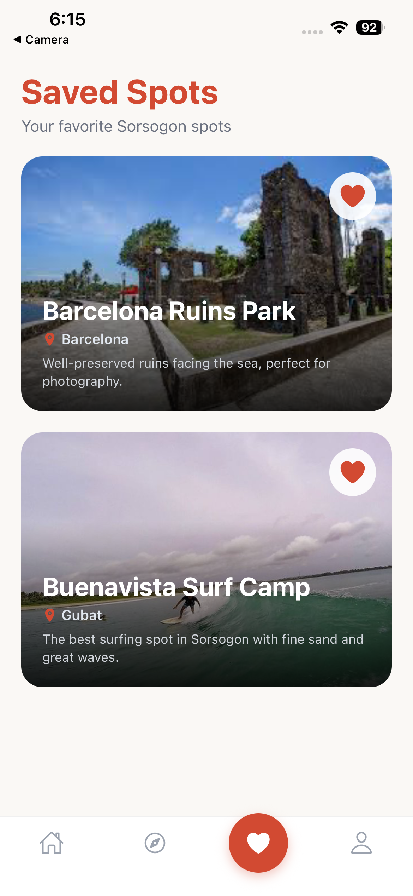 - *Cloud-synced personalized itinerary data*
12. 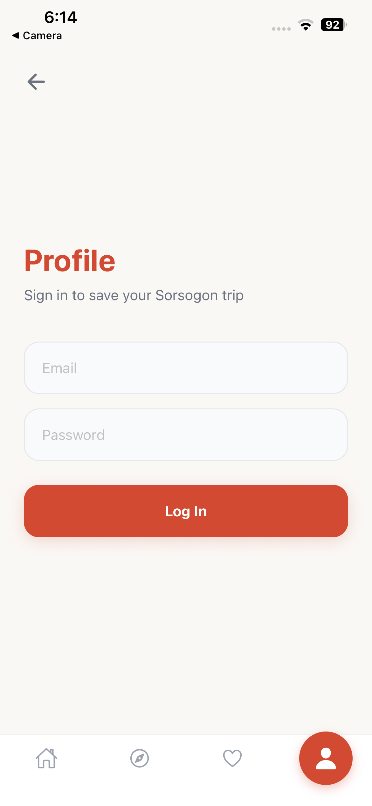 - *User profile management and avatar settings*
---

## 7. Setup & Build Instructions

**Local Development Setup:**
1. Clone the repository: `git clone https://github.com/your-username/waypoint.git`
2. Navigate to the directory: `cd waypoint`
3. Install NPM packages: `npm install`
4. Setup Environment Variables: Create a `.env` file at the root and add your Firebase config variables (`EXPO_PUBLIC_FIREBASE_API_KEY`, etc.).
5. Run the development server: `npx expo start`
6. Press `a` for Android Emulator or scan the QR code via the Expo Go mobile app.

**Generating the Production Release Build:**
To build the standalone `.apk` for Android testing via Expo Application Services (EAS):
```bash
eas build -p android --profile preview